<center>数据库系统实验<center>
<center>实验报告<center>

| 题目 | （实验 3） |
| ---- | ---------- |
| 姓名 | 俞泽斌     |
| 学号 | 20337263   |
| 班级 | 计科 2 班  |

## 一 、实验环境

1、 操作系统： Windows 10
2、 DBMS ： mysql 

## 二 、实验内容

#### 1、创建数据库以及表

（其实一开始拿work bench做完了，后来发现要用命令行，那就重新来一遍）

用已掌握的方法创建订报管理子系统的数据库DingBao，并创建三个表

```sql
 create database DingBao default character set utf8;  
```

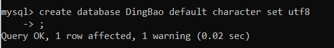

然后转到这个数据库里面,开始输入建表的命令

```sql
use DingBao;
```

```sql
create table paper (
	pno varchar(6) not null,
	pna varchar(10) not null,
	ppr real,
	primary key (pno)
);
create table cp (
	cno varchar(4) not null,
	pno varchar(6) not null,
	num int default 1,
	primary key (cno, pno)
);
create table customer (
	cno varchar(4) not null,
	cna varchar(10) not null,
	adr varchar(20) not null,
	primary key(cno)
);
```

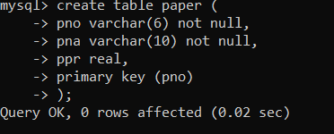

可以输入命令来判断是否创建完成表格

```sql
show tables;
```


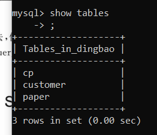

此时在数据库中已经建好了表格的大体框架，具体数据我们先放在下面的表格中

paper

| 报纸编号(pno)(主键) | 报纸名称(pna) | 单价(ppr) |
| ------------------- | ------------- | --------- |
| 000001              | 人民日报      | 12.5      |
| 000002              | 解放军报      | 14.5      |
| 000003              | 光明日报      | 10.5      |
| 000004              | 青年报        | 11.5      |
| 000005              | 扬子日报      | 18.5      |

cp

| 顾客编号(cno)(主键) | 报纸编号(pno)(主键) | 订阅份数(num)(默认为 1) |
| ------------------- | ------------------- | ----------------------- |
| 0001                | 000001              | 2                       |
| 0001                | 000002              | 4                       |
| 0001                | 000005              | 6                       |
| 0002                | 000001              | 2                       |
| 0002                | 000003              | 2                       |
| 0002                | 000005              | 2                       |
| 0003                | 000003              | 2                       |
| 0003                | 000004              | 4                       |
| 0004                | 000001              | 1                       |
| 0004                | 000003              | 3                       |
| 0004                | 000005              | 2                       |
| 0005                | 000003              | 4                       |
| 0005                | 000002              | 1                       |
| 0005                | 000004              | 3                       |
| 0005                | 000005              | 5                       |
| 0005                | 000001              | 4                       |

customer 

| 顾客编号(cno)(主键) | 顾客姓名(cna) | 顾客地址(adr)       |
| ------------------- | ------------- | ------------------- |
| 0001                | 李涛          | 无锡市解放东路123号 |
| 0002                | 钱金浩        | 无锡市人民西路234号 |
| 0003                | 邓杰          | 无锡市惠河路432号   |
| 0004                | 朱海红        | 无锡市中山东路432号 |
| 0005                | 欧阳阳文      | 无锡市中山东路532号 |

对于这些表格中的数据，这里采用insert命令将他们都插入到原有的表格框架中

首先是paper表

```sql
insert into paper values('000001','人民日报',12.5);
insert into paper values('000002','解放军报',14.5);
insert into paper values('000003','光明日报',10.5);
insert into paper values('000004','青年报',11.5);
insert into paper values('000005','扬子日报',18.5);  
```

运行结果

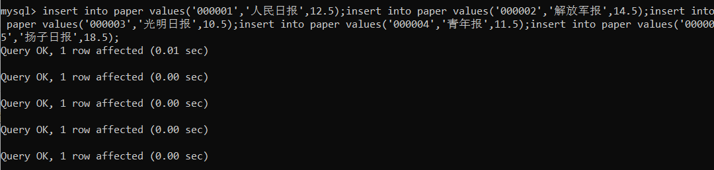

验证结果

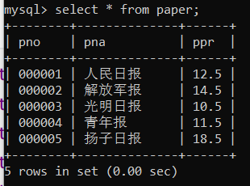

同理接下来是cp表

```sql
insert into cp values('0001','000001',2);
insert into cp values('0001','000002',4);
insert into cp values('0001','000005',6);
insert into cp values('0002','000001',2);
insert into cp values('0002','000003',2);
insert into cp values('0002','000005',2);
insert into cp values('0003','000003',2);
insert into cp values('0003','000004',4);
insert into cp values('0004','000001',1);
insert into cp values('0004','000003',3);
insert into cp values('0004','000005',2);
insert into cp values('0005','000003',4);
insert into cp values('0005','000002',1);
insert into cp values('0005','000004',3);
insert into cp values('0005','000005',5);
insert into cp values('0005','000001',4);
```

验证结果

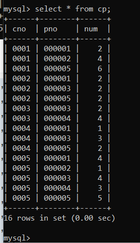

customer表

```sql
insert into customer values('0001','李涛','无锡市解放东路123号');
insert into customer values('0002','钱金浩','无锡市人民西路234号');
insert into customer values('0003','邓杰','无锡市惠和路432号');
insert into customer values('0004','朱海红','无锡市中山东路432号');
insert into customer values('0005','欧阳阳文','无锡市中山东路532号');
```

验证结果

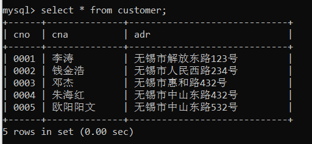

#### 2、创建和使用视图

（1）在 DingBao 数据库中创建含有顾客编号、 顾客名称、 报纸编号、 报纸名称、 订阅份数等信息的视图， 视图名为C_P_N  

首先创建视图，输入所需要挑选的变量，输入命令

```sql
create view C_P_N (cno, cna, pno, pna, num)
as select cno, cna, pno, pna, num
from paper natural join cp natural join customer;
```

验证一下

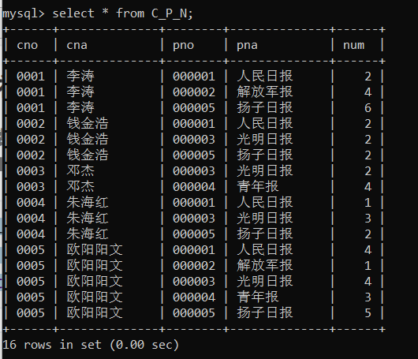

可以看到视图建立成功

（2）修改已创建的视图C_P_N，使其含报纸单价信息  

这里的思路就是直接重新修改视图的几个元素，使得视图元素为顾客编号、 顾客名称、 报纸编号、 报纸名称、 订阅份数、报纸单价，其余和上面命令一致

```sql
alter view C_P_N as
select cno, cna, pno, pna, num, ppr
from paper natural join cp natural join customer;
```

同样进行验证

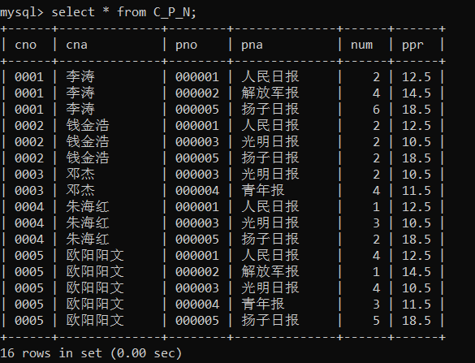

此时看到视图修改成功，出现了报纸的单价

（3）通过视图 C_P_N 查询 “人民日报” 被订阅的情况， 能通过视图C_P_N实现对数据的更新操作吗？请尝试各种更新操作， 例如修改某人订阅某报的份数， 修改某报的名称等  

首先来查询人民日报的订阅情况，也就是从视图中取出pna为人民日报的行

```sql
select * from C_P_N
where pna='人民日报';  
```

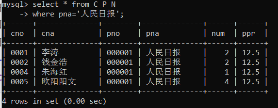

此时出现了人民日报订阅的每一行，查到了对应的信息

下面来尝试更新操作，我这里将李涛订阅人民日报的份数改为3,输入命令

```sql
update C_P_N
set num=3
where cno='0001' and pno='000001';
```

运行结果如下图

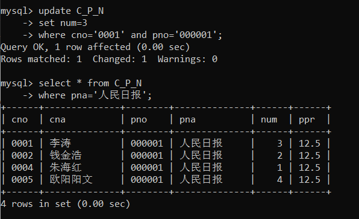

可以看到此时C_P_N视图下的李涛所对应的人民日报份数已经发生了改变，现在可以看下数据库下的表里面数据有无更改

```sql
select * from cp
where cno='0001' and pno='000001';
```

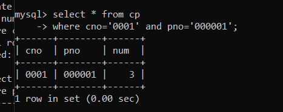

发现数据库中的cp表内订阅份数已经做出了修改，说明对视图的改动也会改动原来的数据库。

第二个修改的点是 修改某报的名称，这里我将扬子日报改为广州日报，操作代码如下

```sql
update C_P_N
set pna='广州日报'
where pno='000005';
```

重新查看整张视图

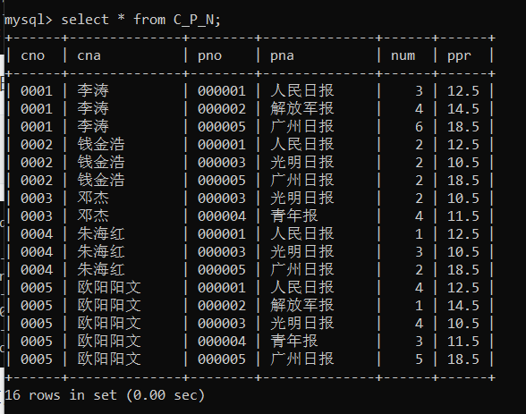

同时查看整个paper表确定

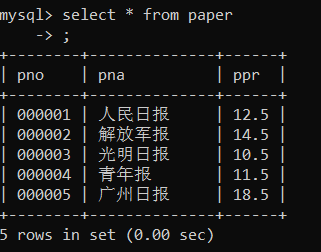

说明此时对于视图的pna的修改也改动了表中的pna，表明能够通过视图C_P_N实现对数据的更新操作

（4）删除视图  

即输入命令

```sql
drop view C_P_N;
```

返回

```
Query OK, 0 rows affected (0.04 sec)
```

实验结束。

