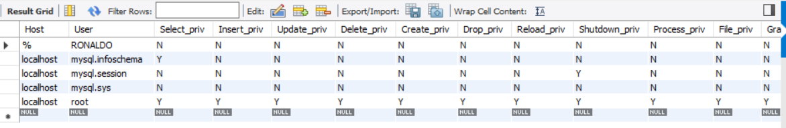
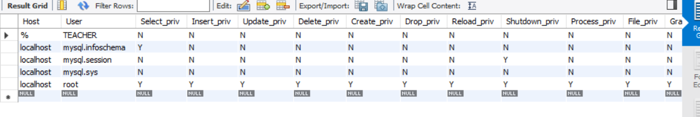
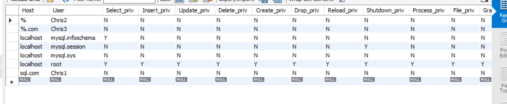
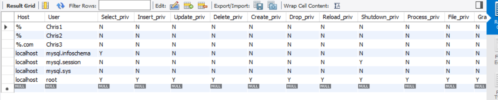

<center>数据库系统实验<center>
<center>实验报告<center>

| 题目 | （实验 10） |
| ---- | ----------- |
| 姓名 | 俞泽斌      |
| 学号 | 20337263    |
| 班级 | 计科 2 班   |

## 一 、实验环境

1、 操作系统： Windows 10
2、 DBMS ： mysql 

## 二 、实验内容

对教学管理系统(jxgl)执行如下操作。
(1)创建名为RONALDO,密码为NIKE的用户，然后显示MySQL中user表的内容。

输入命令

```sql
CREATE USER RONALDO IDENTIFIED BY'NIKE';
```

```sql
Query OK, 0 rows affected (0.03 sec)
```

创建成功

接下来进行查看

```sql
select * from mysql.user;
```

命令行中打入时限于篇幅限制而显示有点问题，所以这里采用在workbench中输入该命令



(2)把用户RONALDO改名为TEACHER,然后显示MySQL中user表的内容。

输入命令

```sql
Rename user RONALDO to TEACHER;
```

```sql
Query OK, 0 rows affected (0.04 sec)
```

同上在workbench中输入

```sql
select * from mysql.user;
```



(3)把TEACHER的密码改为hello

输入命令

```sql
set password for TEACHER=password('hello');
```

报错

```sql
ERROR 1064 (42000): You have an error in your SQL syntax; check the manual that corresponds to your MySQL server version for the right syntax to use near 'password('hello')' at line 1
```

查询资料得版本问题，需要更正为以下命令

```sql
set password for TEACHER='hello';
```

```sql
Query OK, 0 rows affected (0.04 sec)
```


(4)删除TEACHER用户。

输入命令

```sql
drop user TEACHER;
```

```sql
Query OK, 0 rows affected (0.04 sec)
```


(5)新建三个用户：

用户名：Chrisl@sql.com,密码：1234

用户名：Chris2@%,密码：12345

用户名：Chris3@%.com,密码：123456

然后显示MySQL中user表的内容。

输入命令

```sql
CREATE USER Chris1@'sql.com' IDENTIFIED BY'1234';
CREATE USER Chris2@'%' IDENTIFIED BY'12345';
CREATE USER Chris3@'%.com' IDENTIFIED BY'12346';
```

均为

```sql
Query OK, 0 rows affected (0.04 sec)
```

查看user表，在workbench中输入

```sql
select * from mysql.user;
```

得到




(6)授予Chrisl@sql.com用户在student表上的select update权限，并且他可以传递给其他用户。以Chrisl@sqLcom用户登录，把在

student表上的select update权限授予chris2@%。

如果用Chrisl@sql.com用户进行实验的时候登录不上，同时因为是本地进行测试，所以先将用户 Chris1@sql.com 更名为 Chris1@%   

```sql
rename user Chris1@'sql.com' to Chris1@'%';
```

```sql
Query OK, 0 rows affected (0.02 sec)
```

此时再次输入查看命令

```sql
select * from mysql.user;
```



输入命令

```sql
grant select, update on jxgl.student to Chris1 with grant option;
```

```sql
Query OK, 0 rows affected (0.04 sec)
```

查看权限

```sql
show grants for 'Chris1'@'%';
+----------------------------------------------------------------------------+
| Grants for Chris1@%                                                        |
+----------------------------------------------------------------------------+
| GRANT USAGE ON *.* TO `Chris1`@`%`                                         |
| GRANT SELECT, UPDATE ON `jxgl`.`student` TO `Chris1`@`%` WITH GRANT OPTION |
+----------------------------------------------------------------------------+
2 rows in set (0.00 sec)
```

可以看到此时权限已经获得

现在登录Chris1

```sql
mysql -u Chris1 -p1234
```

```sql
mysql: [Warning] Using a password on the command line interface can be insecure.
Welcome to the MySQL monitor.  Commands end with ; or \g.
Your MySQL connection id is 11
Server version: 8.0.30 MySQL Community Server - GPL

Copyright (c) 2000, 2022, Oracle and/or its affiliates.

Oracle is a registered trademark of Oracle Corporation and/or its
affiliates. Other names may be trademarks of their respective
owners.

Type 'help;' or '\h' for help. Type '\c' to clear the current input statement.
```

登录成功，现在把在student表上的select update权限授予chris2@%

输入命令

```sql
grant select, update on jxgl.student to Chris2;
```

```sql
Query OK, 0 rows affected (0.04 sec)
```

现在查看Chris2@%的权限

```sql
show grants for 'Chris2'@'%';
```

```sql
+----------------------------------------------------------+
| Grants for Chris2@%                                      |
+----------------------------------------------------------+
| GRANT USAGE ON *.* TO `Chris2`@`%`                       |
| GRANT SELECT, UPDATE ON `jxgl`.`student` TO `Chris2`@`%` |
+----------------------------------------------------------+
2 rows in set (0.00 sec)
```

可以看到权限授予成功

重新将Chris1的名字改回

```sql
rename user Chris1@'%' to Chris1@'sql.com';
```

```sql
Query OK, 0 rows affected (0.04 sec)
```

(7)授予Chris3@%.com用户在jxgl数据库中所有表的select权限。

输入命令

```sql
grant select on jxgl.* to Chris3@'%.com';
```

```sql
Query OK, 0 rows affected (0.04 sec)
```

查看权限

```sql
show grants for 'Chris3'@'%.com';
```

```sql
+----------------------------------------------+
| Grants for Chris3@%.com                      |
+----------------------------------------------+
| GRANT USAGE ON *.* TO `Chris3`@`%.com`       |
| GRANT SELECT ON `jxgl`.* TO `Chris3`@`%.com` |
+----------------------------------------------+
2 rows in set (0.00 sec)
```

授权成功

(9)回收Chrisl@sql.com的权限，并且查看chris2@%的权限。

回收

```sql
revoke all on jxgl.student from Chris1@'sql.com';
```

```sql
Query OK, 0 rows affected (0.04 sec)
```

查看此时有无权限

```sql
show grants for 'Chris1'@'sql.com';
```

```sql
+-------------------------------------------------------------------------+
| Grants for Chris1@sql.com                                               |
+-------------------------------------------------------------------------+
| GRANT USAGE ON *.* TO `Chris1`@`sql.com`                                |
| GRANT USAGE ON `jxgl`.`student` TO `Chris1`@`sql.com` WITH GRANT OPTION |
+-------------------------------------------------------------------------+
2 rows in set (0.00 sec)
```

此时没有select和update权限，回收成功

查看chris2@%的权限。

```sql
show grants for 'Chris2'@'%';
```

```sql
+----------------------------------------------------------+
| Grants for Chris2@%                                      |
+----------------------------------------------------------+
| GRANT USAGE ON *.* TO `Chris2`@`%`                       |
| GRANT SELECT, UPDATE ON `jxgl`.`student` TO `Chris2`@`%` |
+----------------------------------------------------------+
2 rows in set (0.00 sec)
```

实验结束