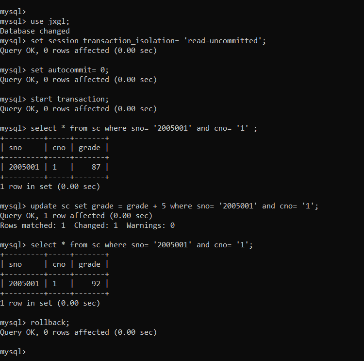
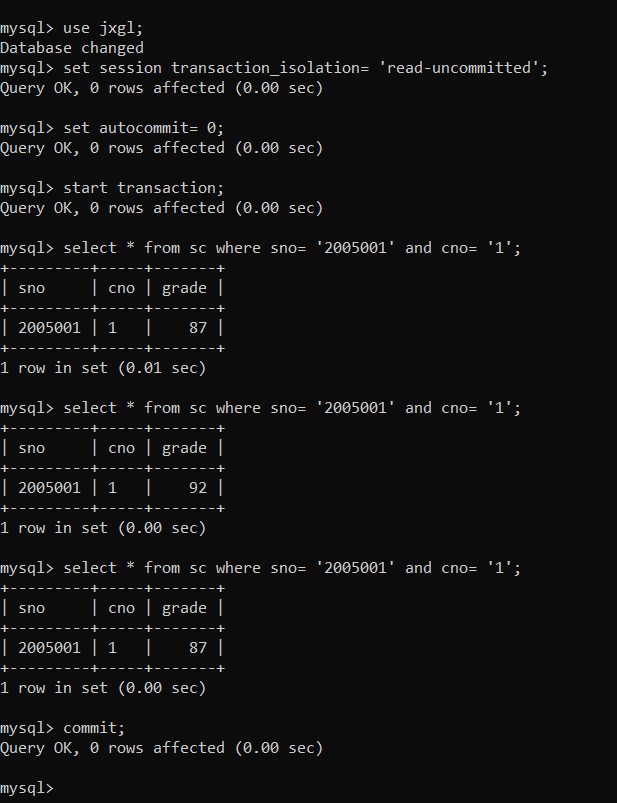
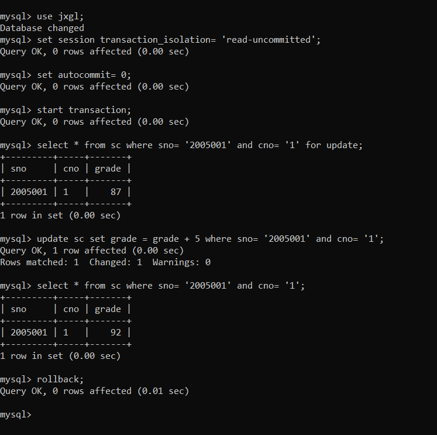
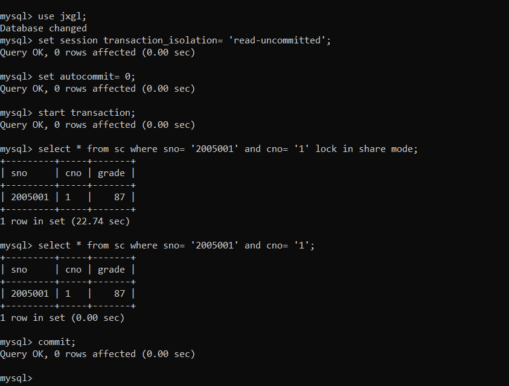

<center>数据库系统实验<center>
<center>实验报告<center>

| 题目 | （实验 12） |
| ---- | ----------- |
| 姓名 | 俞泽斌      |
| 学号 | 20337263    |
| 班级 | 计科 2 班   |

## 一 、实验环境

1、 操作系统： Windows 10
2、 DBMS ： mysql 

## 二 、实验内容

首先是表12-5 innoDB存储脏读

因为所用mysql版本与书上的不符，所以经过查找资料后对命令进行下述改动

session_1

```sql
use jxgl;
set session transaction_isolation= 'read-uncommitted';
set autocommit= 0;
start transaction;
select * from sc where sno= '2005001' and cno= '1' ;
update sc set grade = grade + 5 where sno= '2005001' and cno= '1';
select * from sc where sno= '2005001' and cno= '1';
rollback;
```

session_2

```sql
use jxgl;
set session transaction_isolation= 'read-uncommitted';
set autocommit= 0;
start transaction;
select * from sc where sno= '2005001' and cno= '1';
select * from sc where sno= '2005001' and cno= '1';
select * from sc where sno= '2005001' and cno= '1';
commit;
```

按照表格中的时间顺序执行上述命令

session_1



```sql
mysql> use jxgl;
Database changed
mysql> set session transaction_isolation= 'read-uncommitted';
Query OK, 0 rows affected (0.00 sec)

mysql> set autocommit= 0;
Query OK, 0 rows affected (0.00 sec)

mysql> start transaction;
Query OK, 0 rows affected (0.00 sec)

mysql> select * from sc where sno= '2005001' and cno= '1';
+---------+-----+-------+
| sno     | cno | grade |
+---------+-----+-------+
| 2005001 | 1   |    87 |
+---------+-----+-------+
1 row in set (0.00 sec)

mysql> update sc set grade = grade + 5 where sno= '2005001' and cno= '1';
Query OK, 1 row affected (0.00 sec)
Rows matched: 1  Changed: 1  Warnings: 0

mysql> rollback;
Query OK, 0 rows affected (0.00 sec)
```


session_2



```sql
mysql> use jxgl;
Database changed
mysql> set session transaction_isolation= 'read-uncommitted';
Query OK, 0 rows affected (0.00 sec)

mysql> set autocommit= 0;
Query OK, 0 rows affected (0.00 sec)

mysql> start transaction;
Query OK, 0 rows affected (0.00 sec)

mysql> select * from sc where sno= '2005001' and cno= '1';
+---------+-----+-------+
| sno     | cno | grade |
+---------+-----+-------+
| 2005001 | 1   |    87 |
+---------+-----+-------+
1 row in set (0.00 sec)

mysql> select * from sc where sno= '2005001' and cno= '1';
+---------+-----+-------+
| sno     | cno | grade |
+---------+-----+-------+
| 2005001 | 1   |    92 |
+---------+-----+-------+
1 row in set (0.00 sec)

mysql> select * from sc where sno= '2005001' and cno= '1';
+---------+-----+-------+
| sno     | cno | grade |
+---------+-----+-------+
| 2005001 | 1   |    87 |
+---------+-----+-------+
1 row in set (0.00 sec)
```

此时可以看出，在session1进行的时候，session2会读到其中被session1中间修改过的数据，即中间变量，一开始grade=87，在session1中对其进行了加5的修改，我们此时session2进行读取，会看到进行过+5修改后的数据，而不是session1 完全进行结束，即rollback后的数据，说明不同的事务下， 可以读到另外事务未提交的数据， 则违反了数据库的隔离性 ，两个事务之间形成了脏读

12-6表

InnoDB存储引擎避免脏读  

session_1

```sql
use jxgl;
set session transaction_isolation= 'read-uncommitted';
set autocommit= 0;
start transaction;
select * from sc where sno= '2005001' and cno= '1' for update;
update sc set grade = grade + 5 where sno= '2005001' and cno= '1';
select * from sc where sno= '2005001' and cno= '1';
rollback;
```

session_2

```sql
use jxgl;
set session transaction_isolation= 'read-uncommitted';
set autocommit= 0;
start transaction;
select * from sc where sno= '2005001' and cno= '1' lock in share mode;
select * from sc where sno= '2005001' and cno= '1';
commit;
```

按照表格中的时间顺序执行上述命令

session_1



```sql
mysql> use jxgl;
Database changed
mysql> set session transaction_isolation= 'read-uncommitted';
Query OK, 0 rows affected (0.00 sec)

mysql> set autocommit= 0;
Query OK, 0 rows affected (0.00 sec)

mysql> start transaction;
Query OK, 0 rows affected (0.00 sec)

mysql> select * from sc where sno= '2005001' and cno= '1' for update;
+---------+-----+-------+
| sno     | cno | grade |
+---------+-----+-------+
| 2005001 | 1   |    87 |
+---------+-----+-------+
1 row in set (0.00 sec)

mysql> update sc set grade = grade + 5 where sno= '2005001' and cno= '1';
Query OK, 1 row affected (0.00 sec)
Rows matched: 1  Changed: 1  Warnings: 0

mysql> select * from sc where sno= '2005001' and cno= '1';
+---------+-----+-------+
| sno     | cno | grade |
+---------+-----+-------+
| 2005001 | 1   |    92 |
+---------+-----+-------+
1 row in set (0.00 sec)

mysql> rollback;
Query OK, 0 rows affected (0.00 sec)
```

session_2



```sql
mysql> use jxgl;
Database changed
mysql> set session transaction_isolation= 'read-uncommitted';
Query OK, 0 rows affected (0.00 sec)

mysql> set autocommit= 0;
Query OK, 0 rows affected (0.00 sec)

mysql> start transaction;
Query OK, 0 rows affected (0.00 sec)

mysql> select * from sc where sno= '2005001' and cno= '1' lock in share mode;
+---------+-----+-------+
| sno     | cno | grade |
+---------+-----+-------+
| 2005001 | 1   |    87 |
+---------+-----+-------+
1 row in set (22.74 sec)

mysql> select * from sc where sno= '2005001' and cno= '1';
+---------+-----+-------+
| sno     | cno | grade |
+---------+-----+-------+
| 2005001 | 1   |    87 |
+---------+-----+-------+
1 row in set (0.00 sec)

mysql> commit;
Query OK, 0 rows affected (0.00 sec)
```

此时通过锁的机制，即session1中的 for update 互斥锁，然后session2进行等待（lock in share mode），与session1不兼容，所以只能等待session1结束才能继续进行，从而避免了脏读

