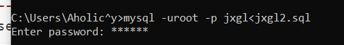
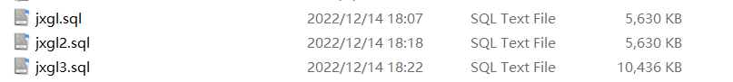

<center>数据库系统实验<center>
<center>实验报告<center>

| 题目 | （实验 13） |
| ---- | ----------- |
| 姓名 | 俞泽斌      |
| 学号 | 20337263    |
| 班级 | 计科 2 班   |

## 一 、实验环境

1、 操作系统： Windows 10
2、 DBMS ： mysql 

## 二 、实验内容

#### （1） 对表 sc,course 和 student 分别做表备份和表恢复  

##### 备份操作

先加锁后备份

```sql
use jxgl;
lock tables student read;
select * into outfile 'student.bak' from student;
unlock tables;
lock tables sc read;
select * into outfile 'sc.bak' from sc;
unlock tables;
lock tables course read;
select * into outfile 'course.bak' from course;
unlock tables;
```

然后发现出现如下报错

```sql
ERROR 1290 (HY000): The MySQL server is running with the --secure-file-priv option so it cannot execute this statement
```

查询资料，使用

```sql
show variables like '%secure%';
```

查看 secure-file-priv 当前的值是什么

```sql
mysql> show variables like '%secure%';
+--------------------------+------------------------------------------------+
| Variable_name            | Value                                          |
+--------------------------+------------------------------------------------+
| require_secure_transport | OFF                                            |
| secure_file_priv         | C:\ProgramData\MySQL\MySQL Server 8.0\Uploads\ |
+--------------------------+------------------------------------------------+
2 rows in set (0.00 sec)
```

将路径添加到命令中，注意是/而非\

```sql
use jxgl;
lock tables student read;
select * into outfile 'C://ProgramData/MySQL/MySQL Server 8.0/Uploads/student.bak' from student;
unlock tables;
lock tables sc read;
select * into outfile 'C://ProgramData/MySQL/MySQL Server 8.0/Uploads/sc.bak' from sc;
unlock tables;
lock tables course read;
select * into outfile 'C://ProgramData/MySQL/MySQL Server 8.0/Uploads/course.bak' from course;
unlock tables;
```

```sql
mysql> lock tables student read;
Query OK, 0 rows affected (0.00 sec)

mysql> select * into outfile 'C://ProgramData/MySQL/MySQL Server 8.0/Uploads/student.bak' from student;
Query OK, 8 rows affected (0.01 sec)

mysql> unlock tables;
Query OK, 0 rows affected (0.00 sec)

mysql> lock tables sc read;
Query OK, 0 rows affected (0.00 sec)

mysql> select * into outfile ' C://ProgramData/MySQL/MySQL Server 8.0/Uploads/sc.bak' from sc;
ERROR 1290 (HY000): The MySQL server is running with the --secure-file-priv option so it cannot execute this statement
mysql> unlock tables;
Query OK, 0 rows affected (0.00 sec)

mysql> lock tables course read;
Query OK, 0 rows affected (0.00 sec)

mysql> select * into outfile 'C://ProgramData/MySQL/MySQL Server 8.0/Uploads/course.bak' from course;
Query OK, 7 rows affected (0.01 sec)

mysql> unlock tables;
Query OK, 0 rows affected (0.00 sec)

mysql> lock tables sc read;
Query OK, 0 rows affected (0.00 sec)

mysql> select * into outfile 'C://ProgramData/MySQL/MySQL Server 8.0/Uploads/sc.bak' from sc;
Query OK, 18 rows affected (0.01 sec)

mysql> unlock tables;
Query OK, 0 rows affected (0.00 sec)
```

结果

```sql
mysql> lock tables student read;
Query OK, 0 rows affected (0.00 sec)

mysql> select * into outfile 'C://ProgramData/MySQL/MySQL Server 8.0/Uploads/student.bak' from student;
Query OK, 8 rows affected (0.01 sec)

mysql> unlock tables;
Query OK, 0 rows affected (0.00 sec)

mysql> lock tables sc read;
Query OK, 0 rows affected (0.00 sec)

mysql> select * into outfile 'C://ProgramData/MySQL/MySQL Server 8.0/Uploads/sc.bak' from sc;
ERROR 1290 (HY000): The MySQL server is running with the --secure-file-priv option so it cannot execute this statement
mysql> unlock tables;
Query OK, 0 rows affected (0.00 sec)

mysql> lock tables course read;
Query OK, 0 rows affected (0.00 sec)

mysql> select * into outfile 'C://ProgramData/MySQL/MySQL Server 8.0/Uploads/course.bak' from course;
Query OK, 7 rows affected (0.01 sec)

mysql> unlock tables;
Query OK, 0 rows affected (0.00 sec)

mysql> lock tables sc read;
Query OK, 0 rows affected (0.00 sec)

mysql> select * into outfile 'C://ProgramData/MySQL/MySQL Server 8.0/Uploads/sc.bak' from sc;
Query OK, 18 rows affected (0.01 sec)

mysql> unlock tables;
Query OK, 0 rows affected (0.00 sec)
```

完成备份

##### 恢复

首先我们看一下最初的sc表

```sql
select * from sc;
```

结果

```sql
+---------+-----+-------+
| sno     | cno | grade |
+---------+-----+-------+
| 2005001 | 1   |    87 |
| 2005002 | 2   |    94 |
| 2005002 | 3   |  NULL |
| 2005003 | 3   |    88 |
| 2005003 | 7   |  NULL |
| 2005010 | 2   |  NULL |
| 2005010 | 3   |    80 |
| 2005010 | 4   |    87 |
| 2005010 | 6   |    85 |
| 2005011 | 1   |  NULL |
| 2005011 | 2   |    48 |
| 2005011 | 3   |    56 |
| 2005011 | 5   |    47 |
| 2005012 | 1   |    84 |
| 2005012 | 3   |  NULL |
| 2005012 | 4   |    67 |
| 2005012 | 5   |    81 |
| 2005012 | 7   |  NULL |
+---------+-----+-------+
18 rows in set (0.00 sec)
```

做以下改动

```sql
update sc set grade=99 where sno='2005001';
```

```sql
Query OK, 1 row affected (0.01 sec)
Rows matched: 1  Changed: 1  Warnings: 0
```

查看

```sql
select * from sc where sno='2005001';
```

```sql
+---------+-----+-------+
| sno     | cno | grade |
+---------+-----+-------+
| 2005001 | 1   |    99 |
+---------+-----+-------+
1 row in set (0.00 sec)
```

之后进行恢复

```sql
SET FOREIGN_KEY_CHECKS = 0;
lock tables student write;
load data infile 'C://ProgramData/MySQL/MySQL Server 8.0/Uploads/student.bak' replace into table student;
unlock tables;
set foreign_key_checks = 1;
lock tables sc write;
load data infile 'C://ProgramData/MySQL/MySQL Server 8.0/Uploads/sc.bak' replace into table sc;
unlock tables;
SET FOREIGN_KEY_CHECKS = 0;
lock tables course write;
load data infile 'C://ProgramData/MySQL/MySQL Server 8.0/Uploads/course.bak' replace into table course;
unlock tables;
set foreign_key_checks = 1;
```

运行结果

```sql
mysql> SET FOREIGN_KEY_CHECKS = 0;
Query OK, 0 rows affected (0.00 sec)

mysql> lock tables student write;
Query OK, 0 rows affected (0.00 sec)

mysql> load data infile 'C://ProgramData/MySQL/MySQL Server 8.0/Uploads/student.bak' replace into table student;
Query OK, 8 rows affected (0.01 sec)
Records: 8  Deleted: 0  Skipped: 0  Warnings: 0

mysql> unlock tables;
Query OK, 0 rows affected (0.00 sec)

mysql> set foreign_key_checks = 1;
Query OK, 0 rows affected (0.00 sec)

mysql> lock tables sc write;
Query OK, 0 rows affected (0.00 sec)

mysql> load data infile 'C://ProgramData/MySQL/MySQL Server 8.0/Uploads/sc.bak' replace into table sc;
Query OK, 19 rows affected (0.00 sec)
Records: 18  Deleted: 1  Skipped: 0  Warnings: 0

mysql> unlock tables;
Query OK, 0 rows affected (0.00 sec)

mysql> SET FOREIGN_KEY_CHECKS = 0;
Query OK, 0 rows affected (0.00 sec)

mysql> lock tables course write;
Query OK, 0 rows affected (0.00 sec)

mysql> load data infile 'C://ProgramData/MySQL/MySQL Server 8.0/Uploads/course.bak' replace into table course;
Query OK, 14 rows affected (0.00 sec)
Records: 7  Deleted: 7  Skipped: 0  Warnings: 0

mysql> unlock tables;
Query OK, 0 rows affected (0.00 sec)

mysql> set foreign_key_checks = 1;
Query OK, 0 rows affected (0.00 sec)
```

此时再次查看sc表中我们修改的部分

```sql
select * from sc where sno='2005001';
```

运行结果

```sql
mysql> select * from sc where sno='2005001';
+---------+-----+-------+
| sno     | cno | grade |
+---------+-----+-------+
| 2005001 | 1   |    87 |
+---------+-----+-------+
1 row in set (0.00 sec)
```

可以看到此时也恢复了改之前的数据，完成了恢复

#### （2）对教学管理系统采用不同方法进行完整备份和恢复

方法一：  

```sql
mysqldump -uroot -p jxgl>jxgl.sql
```

输入密码后生成备份文件


重新对sc表进行修改来测试

```sql
use jxgl;
update sc set grade=0 where sno='2005001';
select * from sc where sno='2005001';
```

结果为

```sql
mysql> update sc set grade=0 where sno='2005001';
Query OK, 1 row affected (0.01 sec)
Rows matched: 1  Changed: 1  Warnings: 0
mysql> select * from sc where sno='2005001';
+---------+-----+-------+
| sno     | cno | grade |
+---------+-----+-------+
| 2005001 | 1   |     0 |
+---------+-----+-------+
1 row in set (0.00 sec)
```

此时我们将备份恢复

```sql
mysql -uroot -p jxgl<jxgl.sql
```

```sql
C:\Users\Aholic^y>mysql -uroot -p jxgl<jxgl.sql
Enter password: ******
```

重新选择上面改动后的数据

```sql
mysql> select * from sc where sno='2005001';
+---------+-----+-------+
| sno     | cno | grade |
+---------+-----+-------+
| 2005001 | 1   |    87 |
+---------+-----+-------+
1 row in set (0.00 sec)
```

可以看到得到的是改动前的数据

方法二

```sql
mysqldump -uroot -p --databases jxgl>jxgl2.sql
```


也做上述的修改操作

```sql
use jxgl;
update sc set grade=0 where sno='2005001';
select * from sc where sno='2005001';
```

结果

```sql
mysql> use jxgl;
Database changed
mysql> update sc set grade=0 where sno='2005001';
Query OK, 1 row affected (0.01 sec)
Rows matched: 1  Changed: 1  Warnings: 0

mysql> select * from sc where sno='2005001';
+---------+-----+-------+
| sno     | cno | grade |
+---------+-----+-------+
| 2005001 | 1   |     0 |
+---------+-----+-------+
1 row in set (0.00 sec)
```

然后恢复

```sql
mysql -uroot -p jxgl<jxgl2.sql
```



重新选择上面改动后的数据

```sql
mysql> use jxgl;
Database changed
mysql> select * from sc where sno='2005001';
+---------+-----+-------+
| sno     | cno | grade |
+---------+-----+-------+
| 2005001 | 1   |    87 |
+---------+-----+-------+
1 row in set (0.00 sec)
```

恢复成功

方法三：

```sql
mysqldump -uroot -p --all-databases>jxgl3.sql
```




重复上面的修改

```sql
mysql> use jxgl;
Database changed
mysql> update sc set grade=0 where sno='2005001';
Query OK, 1 row affected (0.01 sec)
Rows matched: 1  Changed: 1  Warnings: 0

mysql> select * from sc where sno='2005001';
+---------+-----+-------+
| sno     | cno | grade |
+---------+-----+-------+
| 2005001 | 1   |     0 |
+---------+-----+-------+
1 row in set (0.00 sec)
```

恢复

```sql
mysql -uroot -p jxgl<jxgl3.sql
```


重新选择上面改动后的数据

```sql
mysql> use jxgl;
Database changed
mysql> select * from sc where sno='2005001';
+---------+-----+-------+
| sno     | cno | grade |
+---------+-----+-------+
| 2005001 | 1   |    87 |
+---------+-----+-------+
1 row in set (0.00 sec)
```

恢复成功

#### （3）对教学管理系统与 2022 年 12 月 15日上午 12:12 进行了差异备份； 上午 12：15 数据库发生故障， 根据其差异备份和日志文件进行时间点恢复。  

##### 差异备份恢复

首先查看日志是否已经启用

```sql
show variables like '%log_bin%';
```


可以看到此时的日志是启用状态

那么开始进行差异备份

```sql
mysqldump -uroot -p jxgl -F>jxglf.sql
```

同时备份日志文件binlog

```sql
mysqladmin -uroot -p flush-logs
```


开始对数据库进行修改

```sql
use jxgl;
update sc set grade=66 where sno='2005001';
select * from sc where sno='2005001';
```

```sql
mysql> use jxgl;
Database changed
mysql> update sc set grade=66 where sno='2005001';
Query OK, 1 row affected (0.02 sec)
Rows matched: 1  Changed: 1  Warnings: 0

mysql> select * from sc where sno='2005001';
+---------+-----+-------+
| sno     | cno | grade |
+---------+-----+-------+
| 2005001 | 1   |    66 |
+---------+-----+-------+
1 row in set (0.00 sec)
```

然后用备份差异恢复

```sql
mysql -u root -p jxgl<jxglf.sql
```

重新查询

```sql
mysql> use jxgl;
Database changed
mysql> select * from sc where sno='2005001';
+---------+-----+-------+
| sno     | cno | grade |
+---------+-----+-------+
| 2005001 | 1   |    87 |
+---------+-----+-------+
1 row in set (0.00 sec)
```

恢复到之前版本

##### 使用日志文件进行恢复操作

还是进行上述的修改操作

```sql
mysql> use jxgl;
Database changed
mysql> update sc set grade=66 where sno='2005001';
Query OK, 1 row affected (0.02 sec)
Rows matched: 1  Changed: 1  Warnings: 0

mysql> select * from sc where sno='2005001';
+---------+-----+-------+
| sno     | cno | grade |
+---------+-----+-------+
| 2005001 | 1   |    66 |
+---------+-----+-------+
1 row in set (0.00 sec)
```

然后我们查看一下现在的bin文件名

```sql
show master status;
```

```sql
+----------------------------+----------+--------------+------------------+-------------------+
| File                       | Position | Binlog_Do_DB | Binlog_Ignore_DB | Executed_Gtid_Set |
+----------------------------+----------+--------------+------------------+-------------------+
| LAPTOP-BH85TEHU-bin.000023 |  3595738 |              |                  |                   |
+----------------------------+----------+--------------+------------------+-------------------+
1 row in set (0.00 sec)
```

此时我们可以通过两种方式查看具体的位置信息

第一种直接在控制台通过mysql查看

```sql
show binlog events in 'LAPTOP-BH85TEHU-bin.000023';
```


只截取了后面一部分，也可以看到最后一条语句执行的位置

或者采用mysqlbinlog编译后用记事本查看

输入命令

```sql
mysqlbinlog LAPTOP-BH85TEHU-bin.000023> jxgltemp.sql
```


查看文件可以看到update在3595588的位置，最后一条语句在3595707位置上，所以输入命令

```sql
mysqlbinlog --no-defaults --stop-position=3595588 LAPTOP-BH85TEHU-bin.000023|mysql -u root -h localhost -p
mysqlbinlog --no-defaults --start-position=3595707 LAPTOP-BH85TEHU-bin.000023|mysql -u root -h localhost -p
```


实现恢复

验证


可以看到此时完成了位置恢复

