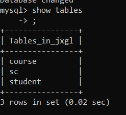

<center>数据库系统实验<center>
<center>实验报告<center>

| 题目 | （实验 4） |
| ---- | ---------- |
| 姓名 | 俞泽斌     |
| 学号 | 20337263   |
| 班级 | 计科 2 班  |

## 一 、实验环境

1、 操作系统： Windows 10
2、 DBMS ： mysql 

## 二 、实验内容

用已掌握的方法创建数据库jxgl，并创建三个表

```sql
create database jxgl default character set utf8;  
```

然后转到这个数据库里面,开始输入建表的命令

```sql
use jxgl;
```

```sql
Create Table Student
(   Sno CHAR(7) NOT NULL ,
	Sname VARCHAR(16),
	Ssex CHAR(2) DEFAULT '男' CHECK (Ssex='男' OR Ssex='女'),
	Sage SMALLINT CHECK(Sage>=15 AND Sage<=45),
	Sdept CHAR(2),
	PRIMARY KEY(Sno)
)  ENGINE = InnoDB;

Create Table COURSE
(   Cno CHAR(2) NOT NULL ,
	Cname VARCHAR(20),
	Cpno CHAR(2),
	Credit SMALLINT,
	PRIMARY KEY(Cno),
	foreign key(cpno) references course(cno)
) ENGINE = InnoDB;

Create table sc
(   sno char(7) not null,
	cno char(2) not null,
	grade smallint null check(grade is null or (grade between 0 and 100)),
	Primary key(sno,cno),
	Foreign key(sno) references student(sno),
	Foreign key(cno) references course(cno)
)  ENGINE = InnoDB; 


```

可以看到表格创建成功，使用

```sql
show tables;
```



表格完成，现在开始往表格中录入数据,

首先将表格放在下面

student

| Sno     | Sname  | Ssex | Sage | Sdept |
| ------- | ------ | ---- | ---- | ----- |
| 2005001 | 钱横   | 男   | 18   | Cs    |
| 2005002 | 王林   | 女   | 19   | Cs    |
| 2005003 | 李民   | 男   | 20   | Is    |
| 2005004 | 赵欣然 | 女   | 16   | Ma    |

course

| cno  | cname        | cpno | credit |
| ---- | ------------ | ---- | ------ |
| 1    | 数据库系统   | 5    | 4      |
| 2    | 数学分析     | NULL | 2      |
| 3    | 信息系统导论 | 1    | 3      |
| 4    | 操作系统原理 | 6    | 3      |
| 5    | 数据结构     | 7    | 4      |
| 6    | 数据处理基础 | NULL | 4      |
| 7    | C语言        | 6    | 7      |

sc

| Sno     | Cno  | Grade |
| ------- | ---- | ----- |
| 2005001 | 1    | 87    |
| 2005001 | 2    | 67    |
| 2005001 | 3    | 90    |
| 2005002 | 2    | 95    |
| 2005003 | 3    | 88    |

student

```sql
insert into student values('2005001','钱横','男',18,'Cs');
insert into student values('2005002','王林','女',19,'Cs');
insert into student values('2005003','李民','男',20,'Is');
insert into student values('2005004','赵欣然','女',16,'Ma');
```

course

```sql
insert into course values('1','数据库系统','5',4);
insert into course values('2','数学分析',null,2);
insert into course values('3','信息系统导论','1',3);
insert into course values('4','操作系统原理','6',3);
insert into course values('5','数据结构','7',4);
insert into course values('6','数据处理基础',null,4);
insert into course values('7','C语言','6',7);
```

sc

```sql
insert into sc values('2005001','1',87);
insert into sc values('2005001','2',67);
insert into sc values('2005001','3',90);
insert into sc values('2005002','2',95);
insert into sc values('2005003','3',88);
```

插入时得到结果均为

```sql
Query OK, 1 row affected (0.00 sec)
```

表明表内数据输入成功

通过select命令查询到表内具体数据如下

```
mysql> select *from student;
+---------+-----------+------+------+-------+
| Sno     | Sname     | Ssex | Sage | Sdept |
+---------+-----------+------+------+-------+
| 2005001 | 钱横      | 男   |   18 | Cs    |
| 2005002 | 王林      | 女   |   19 | Cs    |
| 2005003 | 李民      | 男   |   20 | Is    |
| 2005004 | 赵欣然    | 女   |   16 | Ma    |
+---------+-----------+------+------+-------+
4 rows in set (0.00 sec)
```

```
mysql> select *from course;
+-----+--------------------+------+--------+
| Cno | Cname              | Cpno | Credit |
+-----+--------------------+------+--------+
| 1   | 数据库系统         | 5    |      4 |
| 2   | 数学分析           | NULL |      2 |
| 3   | 信息系统导论       | 1    |      3 |
| 4   | 操作系统原理       | 6    |      3 |
| 5   | 数据结构           | 7    |      4 |
| 6   | 数据处理基础       | NULL |      4 |
| 7   | C语言              | 6    |      7 |
+-----+--------------------+------+--------+
7 rows in set (0.00 sec
```

```
mysql> select *from sc;
+---------+-----+-------+
| sno     | cno | grade |
+---------+-----+-------+
| 2005001 | 1   |    87 |
| 2005001 | 2   |    67 |
| 2005001 | 3   |    90 |
| 2005002 | 2   |    95 |
| 2005003 | 3   |    88 |
+---------+-----+-------+
5 rows in set (0.00 sec)
```

#### 1、基于jxgl数据库，使用sql语句表达以下查询

##### （1）检索年龄大于23岁的男生的学号和姓名

输入代码如下

```sql
select sno,sname
from student
where ssex='男' and sage>23;
```

运行结果

```sql
mysql> select sno,sname
    -> from student
    -> where ssex='男' and sage>23;
Empty set (0.00 sec)
```

##### (2)检索至少选择一门课程的女学生的姓名

输入代码如下

```sql
select sname
from student,sc
where student.sno=sc.sno and ssex='女';
```

运行结果

```sql
+--------+
| sname  |
+--------+
| 王林   |
+--------+
1 row in set (0.00 sec)
```

##### (3)检索王林不学的课程的课程号

输入代码如下

```sql
select cno
from course
where cno not in
(select cno
from student, sc
where student.sno = sc.sno and sname='王林 ');
```

运行结果为

```sql
+-----+
| cno |
+-----+
| 6   |
| 3   |
| 1   |
| 4   |
| 7   |
| 5   |
+-----+
6 rows in set (0.00 sec)
```

##### (4)检索至少选修两门课程的学生学号

输入代码如下

```sql
select sno
from sc
group by sno
having count(*)>=2;
```

运行结果如下

```sql
+---------+
| sno     |
+---------+
| 2005001 |
+---------+
1 row in set (0.00 sec)
```

##### （5）检索全部学生都选修的课程号和课程名

输入代码如下

```sql
select course.cno,course.cname
from sc,course
where sc.cno=course.cno
group by sc.cno
having count(*)=
(select count(*)
from student);
```

运行结果如下

```sql
Empty set (0.00 sec)
```

##### (6)检索选修了所有三学分每门课程的学生的平均成绩

输入代码如下

不存在一门三学分的课没人选

```sql
select avg(grade)
from sc as X
where not exists
(	select Y.cno
	from course as Y
	where Y.cno not in
	(	select Z.cno
		from sc as Z
		where Z.cno = X.cno
	) and credit = 3) 
group by X.sno;
```

运行结果如下

```sql
Empty set (0.00 sec)
```

#### 2、基于jxgl数据库，使用sql语句表达以下查询

##### （1）统计有学生选修的课程门数

输入代码如下

```sql
select count(*)
from course
where course.cno in
(select cno from sc
);
```

运行结果

```sql
+----------+
| count(*) |
+----------+
|        3 |
+----------+
1 row in set (0.00 sec)
```

##### (2)求选修4号课程的学生的平均年龄  

输入代码如下

```sql
select avg(sage)
from student,sc
where student.sno=sc.sno and sc.cno='4';
group by student.sno;
```

运行结果

```sql
Empty set (0.00 sec)
```

##### (3)求学分为 3 的每门课程的学生平均成绩  

输入代码如下

```sql
select avg(grade)
from sc,course
where sc.cno=course.cno and course.credit=3
group by sc.cno;
```

运行结果

```sql
+------------+
| avg(grade) |
+------------+
|    89.0000 |
+------------+
1 row in set (0.00 sec)
```

##### (4)统计每门课程的学生选修人数， 要求超过3人的课程才统计， 要求输出课程号和选修人数， 查询结果按人数降序排列， 若人数相同， 按课程号升序排列  

输入代码如下

```sql
select cno,count(sno)
from sc
group by cno
having count(sno)>3
order by count(sno) desc, cno asc;
```

运行结果如下

```sql
Empty set (0.01 sec)
```

##### (5)检索学号比“王林” 同学大而年龄比她小的学生姓名  

输入代码如下

```sql
select sname
from student
where student.sno>(select sno from student where sname='王林')
and 
student.sage<(select sage from student where sname='王林');
```

运行结果如下

```sql
+-----------+
| sname     |
+-----------+
| 赵欣然    |
+-----------+
1 row in set (0.00 sec)
```

##### (6)检索姓名以“王” 开头的所有学生的姓名和年龄  

输入代码如下

```sql
select sname,sage
from student
where student.sname like '王%';
```

运行结果如下

```sql
+--------+------+
| sname  | sage |
+--------+------+
| 王林   |   19 |
+--------+------+
1 row in set (0.00 sec)
```

##### (7)在sc表中检索成绩为空值的学生的学号和课程号  

输入代码如下

```sql
select sno,cno
from sc
where grade is null;
```

运行结果如下

```sql
Empty set (0.00 sec)
```

##### (8)求年龄大于女学生平均年龄的男学生的姓名和年龄  

输入代码如下

```sql
select sname,sage
from student
where ssex='男' and sage>(select avg(sage)
                        from student
           				where ssex='女');
```

运行结果如下

```sql
+--------+------+
| sname  | sage |
+--------+------+
| 钱横   |   18 |
| 李民   |   20 |
+--------+------+
2 rows in set (0.00 sec)
```

##### (9)求年龄大于所有女学生年龄的男学生的姓名和年龄  

输入代码如下

```sql
select sname,sage
from student
where ssex='男' and sage>(select max(sage)
                        from student
           				where ssex='女');
```

运行结果如下

```sql
+--------+------+
| sname  | sage |
+--------+------+
| 李民   |   20 |
+--------+------+
1 row in set (0.00 sec)
```

##### (10)检索选修 4 门以上课程的学生总成绩(不统计不及格课程)， 并要求按总成绩的降序排列出来  

输入代码如下

```sql
select sum(grade)
from sc
where grade>=60
group by sno
having count(*)>4
order by sum(grade) desc;
```

运行结果如下

```sql
Empty set (0.00 sec)
```

