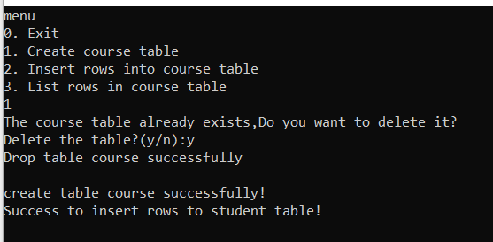

<center>数据库系统实验<center>

<center>实验报告<center>

| 题目 | （实验 6） |
| ---- | ---------- |
| 姓名 | 俞泽斌     |
| 学号 | 20337263   |
| 班级 | 计科 2 班  |

## 一 、实验环境

1、 操作系统： Windows 10
2、 DBMS ： mysql ,vistual studio 2019

## 二 、实验内容

##### (1)模拟 create_student_table()实现创建 SC 表或 Course 表。 即实现 create_sc_table()或 create_course_table()子程序的功能。  

​	首先是关于visual studio 的环境配置，这也是耗费了最多时间的项目，主体内容是参考实验教材中的.net环境的配置结果，一开始并未打开最前面需要写入 * 64的位置，所以文件夹中始终没有出现 * 64的文件夹，导致后面对于libmysql.dll 的放置也出现了问题，就会使visual studio 一直报错为找不到对应的mysql接口函数，解决问题后环境配置完成（即可以跑实验指导中的模板文件）

那么现在来看create操作，我这里选择的是生成course 表，具体函数如下

```c++
int create_course_table() {
	char yn[2];
	result = mysql_list_tables(&mysql, "course");
	unsigned long long num_row = mysql_num_rows(result);
	mysql_free_result(result);
				
	if (num_row) {
		printf("The course table already exists,Do you want to delete it?\n");
		printf("Delete the table?(y/n):");
		cin >> yn[0];
		if (yn[0] == 'y' || yn[0] == 'Y') {
			if (!mysql_query(&mysql, "drop table course;")) {
				cout << "Drop table course successfully\n\n";
			}
			else {
				cout << "ERROR: drop table course\n\n";
			}
		}
	}

```

其实实验中可以发现，对于mysql的接口，其实就是通过mysql_query这个函数，向控制台输出一些mysql的指令，这些指令是字符串类型了，其实也就相当于我们直接从控制台中写入命令一样，所以我们的代码操作就是通过C++进行字符串的拼接来调用mysql_query函数

分段来看，第一步是判断是否已经存在course表，如果存在了向用户询问是否删除重新创建，用的是mysql_list_tables的接口函数，但是这个函数必须通过一个result和num_row 进行参数的传递，直接放置在if语句中会出现报错

```c++
	//创建
	int createflag = 1;
	if (mysql_query(&mysql, "create table course (cno char (2) not null primary key,cname char (30)null,cpno char(2) null, ccredit smallint null,foreign key(cpno) references course(cno) ) engine = innodb; ") == 0) {
		cout << "create table course successfully!" << endl;
	}
	else {
		cout << "ERROR: create table student" << endl;
	}	
```

第二步，如果需要创建，那么向mysql_query函数中输入创建course表的命令，即各个属性以及主键等等，判断是否成功

```c++
if (mysql_query(&mysql, "insert into course values('2','数学分析',null,2);")==0 && \
		mysql_query(&mysql, "insert into course values('6','数据处理基础',null,4);")==0 && \
		mysql_query(&mysql, "insert into course values('4','操作系统原理','6',3);") == 0 && \
		mysql_query(&mysql, "insert into course values('7','C语言','6',3);") == 0 && \
		mysql_query(&mysql, "insert into course values('5','数据结构','7',4);") == 0 && \
		mysql_query(&mysql, "insert into course values('1','数据库原理','5',4);") == 0 && \
		mysql_query(&mysql, "insert into course values('3','信息系统导论','1',3);") == 0){
																				
		printf("Success to insert rows to student table! \n\n");
	}
	else {
		printf("ERROR: insert rows\n\n");

	}
```

最后一步，为了方便之后的操作，我在course表创建时就输入了所有的已知的数据，方便之后对数据进行进一步的操作

##### (2)模拟 insert_rows_into_student_table()实现对 SC 表或 Course 表的记录添加。即实现 insert_rows_into_sc_table()或 insert_rows_into_course_table()子程序的功能。  

我这里写的还是insert_rows_into_course_table()函数

```c++
int insert_rows_into_course_table() {
	char tcno[] = "1";
	char tcname[] = "DatabasePrinciple";
	char tcpno[] = "5";
	char tccredit[]= "4";
	char strquery[100] = "insert into course(cno,cname,cpno,ccredit) values('";
	char yn[2];
	while (1) {
		cout << "Please input cno(eg: 1) :" << endl;
		cin >> tcno; 
		strcat(strquery, tcno);
		strcat(strquery, "','");
		cout << "Please input cname(eg: 数据库系统原理) :" << endl;
		cin >> tcname;
		strcat(strquery, tcname);
		strcat(strquery, "',");
		cout << "Please input cpno(eg: 5) :" << endl;
		cin >> tcpno;
		if (strcmp(tcpno, "null")==0|| strcmp(tcpno, "NULL") == 0) {//0为相等，1为不相等
			strcat(strquery, "null");
		}
		else {
			strcat(strquery, "'");
			strcat(strquery, tcpno);
			strcat(strquery, "'");
		}
		strcat(strquery, ",");
		cout << "Please input ccredit(eg: 4) :" << endl;
		cin >> tccredit;
/*		int end = 0;
		end=strlen(strquery);
		strquery[end] = tccredit;*/
		strcat(strquery, tccredit);
		strcat(strquery, ");");
		cout << strquery << endl;
		if (mysql_query(&mysql, strquery) == 0) {
			cout << "execute successfully!" << endl;
		}
		else {
			cout << "ERROR: execute" << endl;
		}
		cout << "Insert again? (y—yes,n——no)" << endl;
		cin >> yn[0];
		if (yn[0] == 'y' || yn[0] == 'Y') {
			continue;
		}
		else break;
	}
	return 0;
}
```

这里主要涉及的就是字符串的拼接了，因为对于insert操作，我们需要向控制台输入的命令无非是

```sql
insert into course(cno,cname,cpno,ccredit) values('','','','');
```

这一串命令，所以单引号内部的是需要通过用户输入得到的，就不断向用户请求输入，然后进行字符串的拼接，主要要判断的其实就两个位置，一个是对于cpno的判断，因为cpno是可能为NULL的，当为null的时候就不需要添加引号,还有一处是ccredit，因为是smallint类型，所以不需要加引号，其余就直接拼接。

##### (3)main函数以及list函数（UI以及调试函数） 

```c++
int main(int argc, char** argv, char** envp)
{
	
	char fu[2];
	mysql_init(&mysql);//获得或初始化一个MYSQL结构
	mysql_set_character_set(&mysql, "utf8");
	if (mysql_real_connect(&mysql, "localhost", "root", "753951", "lab6", 3306, 0, 0)) {	
		for (;;) {
			printf("menu\n");//菜单
			cout << "0. Exit" << endl;
			cout << "1. Create course table" << endl;
			cout << "2. Insert rows into course table" << endl;
			cout << "3. List rows in course table" << endl;

			cin >> fu[0];
			if (fu[0] == '0') {
				exit(0);
			}
			if (fu[0] == '1') {
				create_course_table();
			}
			if (fu[0] == '2') {
				insert_rows_into_course_table();
			}
			if (fu[0] == '3') {
				list_all();
			}
		}
	}
	else {
		printf("数据库不存在");
	}

	mysql_close(&mysql);//访问完毕，关闭mysql
	result = mysql_store_result(&mysql);
	mysql_free_result(result);
	system("pause");
	return 0;
}
```

首先是main函数，主要也就是一个菜单的页面，起将所有函数调用的操作。

```c++
int list_all() {
	const char* query = "select cno, cname, cpno, ccredit from course;";
	int t = mysql_query(&mysql, query);
	if (t != 0) {
		return 1;
	} 
	result = mysql_store_result(&mysql);
	int num = mysql_field_count(&mysql);
	auto row = mysql_fetch_row(result);
	while (row) {
		for (int i = 0; i < num; ++i) {
			switch (i) {
			case 0:
				cout << "cno: " << row[i] << "\t\t";
				break; 
			case 1:
				cout << "cname: " << (row[i] ? row[i] : "null") <<"\t\t"; 
				break;
			case 2:
				cout << "cpno: " << (row[i] ? row[i] : "null") <<"\t\t";
				break;
			case 3:
				cout << "ccredit: " << (row[i] ? row[i]: "null") <<"\t\t";
				break;
			default:
				break;
			}
		} 
		row = mysql_fetch_row(result);
		cout << '\n';
	} 
	mysql_free_result(result);
	return 0;
}
```

list函数，通过select命令从mysql中读出表中的内容并在控制台上实现输出。

## 三 、实验结果


基础菜单页面



创建表的页面，因为调试过程创建过了，所以这里进行了删除后创建，并创建成功


在控制台中利用mysql语句进行查询，可以看到此时course表的创建以及表中基础数据的读入全部实现成功


通过list函数来读出表中内容，可以看到list函数也实现成功


进行insert操作的尝试，因为mysql和控制台的编码似乎不太一样，一个是UTF8，另一个是GBk，所以用中文的时候不时会出现乱码的情况，这里我就都用英文名来做替代，上图是insert命令时的UI，此时发现成功


调用list命令，可以看到此时创建了一个新的行


控制台中也得到了相同的结果，说明本次实验成功。

## 附录（源代码）

```c++
#include<mysql.h>
#include<stdio.h>
#include<stdlib.h>
#include<winsock.h>
#include<iostream>
using namespace std;
MYSQL mysql;//声明为全局变量，待会在主函数，功能函数中都能对它访问
#pragma warning(disable:4996)
MYSQL_RES* result;

int create_course_table() {
	char yn[2];
	result = mysql_list_tables(&mysql, "course");//判断是否存在相同表
	unsigned long long num_row = mysql_num_rows(result); 
	mysql_free_result(result);
				
	if (num_row) {
		printf("The course table already exists,Do you want to delete it?\n");
		printf("Delete the table?(y/n):");
		cin >> yn[0];
		if (yn[0] == 'y' || yn[0] == 'Y') {
			if (!mysql_query(&mysql, "drop table course;")) {//如果有，删除表
				cout << "Drop table course successfully\n\n";
			}
			else {
				cout << "ERROR: drop table course\n\n";
			}
		}
	}
	//创建
	int createflag = 1;//按照mysql格式来创建表
	if (mysql_query(&mysql, "create table course (cno char (2) not null primary key,cname char (30)null,cpno char(2) null, ccredit smallint null,foreign key(cpno) references course(cno) ) engine = innodb; ") == 0) {
		cout << "create table course successfully!" << endl;
	}
	else {
		cout << "ERROR: create table student" << endl;
	}
	//预输入一些数据来建表
	if (mysql_query(&mysql, "insert into course values('2','MathematicalAnalysis',null,2);")==0 && \
		mysql_query(&mysql, "insert into course values('6','FundamentalsOfDataProcessing',null,4);")==0 && \
		mysql_query(&mysql, "insert into course values('4','OperatingSystemPrinciple','6',3);") == 0 && \
		mysql_query(&mysql, "insert into course values('7','CLanguage','6',3);") == 0 && \
		mysql_query(&mysql, "insert into course values('5','DataStructure','7',4);") == 0 && \
		mysql_query(&mysql, "insert into course values('1','DatabaseSystem','5',4);") == 0 && \
		mysql_query(&mysql, "insert into course values('3','InformationSystems','1',3);") == 0){
																				
		printf("Success to insert rows to student table! \n\n");
	}
	else {
		printf("ERROR: insert rows\n\n");

	}
		
	return 0;

}
int insert_rows_into_course_table() {
	//设定字符串初值
	char tcno[] = "1";
	char tcname[] = "DatabasePrinciple";
	char tcpno[] = "5";
	char tccredit[]= "4";
	char strquery[100] = "insert into course(cno,cname,cpno,ccredit) values('";//基础的语句格式
	char yn[2];
	while (1) {
		cout << "Please input cno(eg: 1) :" << endl;//UI中的输入引导
		cin >> tcno; 
		strcat(strquery, tcno);
		strcat(strquery, "','");//不断做相同的拼接
		cout << "Please input cname(eg: DatabasePrinciple) :" << endl;
		cin >> tcname;
		strcat(strquery, tcname);
		strcat(strquery, "',");
		cout << "Please input cpno(eg: 5) :" << endl;
		cin >> tcpno;
		if (strcmp(tcpno, "null")==0|| strcmp(tcpno, "NULL") == 0) {//0为相等，1为不相等
			strcat(strquery, "null");
		}//特殊情况判断，如果为NULL就不加引号
		else {
			strcat(strquery, "'");
			strcat(strquery, tcpno);
			strcat(strquery, "'");
		}
		strcat(strquery, ",");
		cout << "Please input ccredit(eg: 4) :" << endl;
		cin >> tccredit;
/*		int end = 0;
		end=strlen(strquery);
		strquery[end] = tccredit;*/
		strcat(strquery, tccredit);
		strcat(strquery, ");");
		cout << strquery << endl;
		if (mysql_query(&mysql, strquery) == 0) {
			cout << "execute successfully!" << endl;
		}
		else {
			cout << "ERROR: execute" << endl;
		}
		
	}
	return 0;
}
int list_all() {
	const char* query = "select cno, cname, cpno, ccredit from course;";//主体格式
	int t = mysql_query(&mysql, query);
	if (t != 0) {
		return 1;
	} 
	result = mysql_store_result(&mysql);
	int num = mysql_field_count(&mysql);
	auto row = mysql_fetch_row(result);
	while (row) {
		for (int i = 0; i < num; ++i) {//每一行都要进行是否为null的判断
			switch (i) {
			case 0:
				cout << "cno: " << row[i] << "\t\t";
				break; 
			case 1:
				cout << "cname: " << (row[i] ? row[i] : "null") <<"\t\t"; 
				break;
			case 2:
				cout << "cpno: " << (row[i] ? row[i] : "null") <<"\t\t";
				break;
			case 3:
				cout << "ccredit: " << (row[i] ? row[i]: "null") <<"\t\t";
				break;
			default:
				break;
			}
		} 
		row = mysql_fetch_row(result);
		cout << '\n';
	} 
	mysql_free_result(result);
	return 0;
}
int main(int argc, char** argv, char** envp)
{
	char fu[2];
	mysql_init(&mysql);//获得或初始化一个MYSQL结构
	if (mysql_real_connect(&mysql, "localhost", "root", "753951", "lab6", 3306, 0, 0)) {
		for (;;) {
			printf("menu\n");//菜单
			cout << "0. Exit" << endl;
			cout << "1. Create course table" << endl;
			cout << "2. Insert rows into course table" << endl;
			cout << "3. List rows in course table" << endl;

			cin >> fu[0];
			if (fu[0] == '0') {
				exit(0);
			}
			if (fu[0] == '1') {
				create_course_table();
			}
			if (fu[0] == '2') {
				insert_rows_into_course_table();
			}
			if (fu[0] == '3') {
				list_all();
			}
		}
	}
	else {
		printf("数据库不存在");
	}


	mysql_close(&mysql);//访问完毕，关闭mysql
	result = mysql_store_result(&mysql);
	mysql_free_result(result);
	system("pause");
	return 0;
}

```

